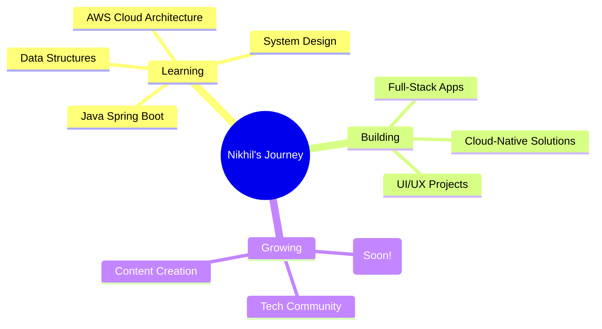

<div align="center">

<!-- Animated Header -->


</div>

<div align="center">
  
[](https://www.hemasatyanikhil.tech/)
[](https://linkedin.com/in/hema-satya-nikhil)
[](mailto:satyanikhil24@gmail.com)
[](https://youtube.com/@ft.nikhil)


</div>

---

## 🎯 About Me

```typescript
const nikhil = {
    location: "India 🇮🇳",
    education: "B.Tech CSE - Final Year @ Srinivasa Institute of Engineering",
    role: "Full-Stack Developer | UI/UX Enthusiast | Content Creator",
    currentFocus: ["AWS Cloud", "Java Backend", "Building Scalable Apps"],
    passion: ["Creating Digital Experiences", "Capturing Memories", "Long Coding Sessions"],
    superpower: "Patience + Creative Problem Solving",
    motto: "Where patience meets code, magic happens ✨",
    funFact: "I can code for hours and edit videos without losing focus!",
    openTo: ["Collaborations", "Freelance Projects", "Learning Opportunities"]
};
```


### 🚀 What Drives Me

- 💻 **Creative Coder** - I don't just write code, I craft experiences
- 🎨 **UI/UX Design Sense** - Making things beautiful AND functional
- 🎬 **Content Creator** - Capturing memories through videos and photos
- 🧩 **Problem Solver** - Love tackling complex challenges with patience
- ⚡ **Fast Learner** - Always hungry for new tech and skills
- 🎯 **Detail-Oriented** - Can sit for hours perfecting that one feature

<br clear="right"/>

---

## 🏆 Achievements & Recognition

<table>
<tr>
<td width="50%">

### 🥇 Competition Wins
- 🏆 **1st Prize** - JNTUK Project Expo (Esparks Event)
- 🥈 **2nd Prize** - VEDHA TechFest, Aditya University
- 🥇 **1st Prize** - VSM College TechFest

</td>
<td width="50%">

### 📜 Certifications
- ✅ MongoDB Node.js Developer Path
- ✅ Building RAG Apps Using MongoDB
- ✅ AWS Cloud Club Member
- ✅ Python for Data Science
- ✅ Frontend Development
- ✅ MongoDB Certification

</td>
</tr>
<tr>
<td colspan="2">

### 🎓 Events & Community
- 🌐 **AWS Community Student Builder Day** - Mohan Babu University, Tirupati
- 👥 Active in Tech Communities & Learning Groups

</td>
</tr>
</table>

---

## 💼 Featured Projects

<div align="center">

| Project | Description | Tech Stack | Live Demo |
|---------|-------------|------------|-----------|
| 🎵 **Listen Music Together** | Real-time collaborative music listening app | React, Node.js, WebSockets | [View Live](https://listen-music-together.vercel.app) |
| 🌐 **Portfolio Website** | Personal portfolio showcasing my work | React, Three.js, GSAP | [Visit Site](https://hemasatyanikhil.tech) |
| 🏥 **DocSpot** | Doctor appointment booking system | MERN Stack, Payment Integration | [Explore →](https://github.com/hema-satya-nikhil/docspot) |
| 📽️ **CSE Projector Project** | Interactive projector management system | React, Express.js, MongoDB | [View Project](https://github.com/hema-satya-nikhil/cse-projector) |
| 🎓 **SRIN Clone** | College website clone with modern design | HTML, CSS, JavaScript, Bootstrap | [Check it out](https://github.com/hema-satya-nikhil/srin-clone) |

</div>

---

## 🛠️ Tech Arsenal

<div align="center">

### Languages


### Frontend Development


### Backend Development


### Cloud & DevOps


### Tools & Others


</div>

---

## 📊 GitHub Analytics

<div align="center">
  


</div>

---

## 🏆 GitHub Trophies

<div align="center">
  
[](https://github.com/ryo-ma/github-profile-trophy)

</div>

---

## 📈 Contribution Graph

<div align="center">


</div>

---

## 💭 Dev Quote

<div align="center">


</div>

---

## 🎯 Current Focus



---

## 🤝 Let's Connect & Collaborate!

<div align="center">

I'm always excited to connect with fellow developers, work on interesting projects, or just have a chat about tech! 

### 📬 Reach Out

[](https://linkedin.com/in/hema-satya-nikhil)
[](https://instagram.com/@unknown_person_nikhil)
[](https://youtube.com/@ft.nikhil)
[](https://www.hemasatyanikhil.tech/)
[](mailto:satyanikhil24@gmail.com)

### 💼 Open For

- 💻 Full-Stack Development Projects
- 🎨 UI/UX Design Collaborations
- 🎬 Content Creation & Video Editing
- 📚 Learning & Knowledge Sharing
- 🚀 Internship Opportunities

</div>

---

<div align="center">

### 🌟 "Where patience meets code, magic happens" ✨

**Thanks for visiting! Let's build something amazing together 🚀**


</div>

---

<div align="center">

**Made with ❤️, ☕, and countless hours of coding by Hema Satya Nikhil**


*Last Updated: May 2026*

</div>
